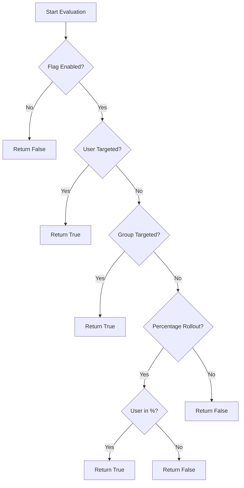

# Semaphore

Lightweight feature-flag service written in Go.

Semaphore provides CRUD and evaluation APIs over HTTP and gRPC, supports percentage/user/group targeting strategies, and stores flag state in PostgreSQL.

## Capabilities

Implemented:

- HTTP API for create/read/update/delete/evaluate flag operations
- gRPC API for create/read/update/delete/evaluate flag operations
- AuthN/AuthZ enforcement via go-lib middleware/interceptors with shared policy maps
- Evaluation engine with:
  - `percentage_rollout`
  - `user_targeting`
  - `group_targeting`
- PostgreSQL-backed persistence for flags and strategies
- Service telemetry hooks (logging, tracing, metrics, health)

Planned next:

- End-to-end audit logging exposure
- GitHub Actions CI/CD
- First-class Go SDK package
- Operational hardening (limits, migrations, rate limiting)

See implementation backlog in [plans/README.md](./plans/README.md).

## Evaluation Logic

The following diagram illustrates the decision flow when evaluating a feature flag:



## Performance Targets

- **Evaluation Latency:** < 10ms (P99)
- **API Response Time:** < 50ms (P99 for CRUD operations)
- **Throughput:** Supports > 5k requests per second on standard hardware.

## Repository Layout

- `api/`: protobuf + OpenAPI definitions
- `config/`: service configuration bootstrap
- `data/`: domain models, source interfaces, evaluation engine integration
- `data/db/`: PostgreSQL datasource and schema bootstrap
- `data/engine/`: flag evaluation logic
- `transport/http/`: HTTP handlers
- `transport/rpc/`: gRPC service handlers
- `semaphore/main.go`: service entrypoint
- `testclient/`: sample client calls for local testing
- `plans/`: active roadmap and task breakdowns

## API Summary

### HTTP

Routes are mounted under `/api` by the shared HTTP server.

- `GET /api/flags`
- `POST /api/flags`
- `GET /api/flags/{id}`
- `PUT /api/flags/{id}`
- `DELETE /api/flags/{id}`
- `POST /api/flags/{id}/evaluate`

<details>
<summary>Sample <code>POST /api/flags/{id}/evaluate</code> Request/Response</summary>

**Request**
```json
{
  "user_id": "user-123",
  "groups": ["beta-testers", "internal-staff"],
  "context": {
    "region": "us-east-1"
  }
}
```

**Response**
```json
{
  "flag_id": "feature-new-ui",
  "enabled": true,
  "strategy": "user_targeting",
  "timestamp": "2026-03-02T23:15:00Z"
}
```
</details>

OpenAPI spec: `api/openapi.yml`

### gRPC

Service: `flag.FlagService`

- `GetFlag`
- `ListFlags` (server streaming)
- `CreateFlag`
- `UpdateFlag`
- `DeleteFlag`
- `Evaluate`

Proto contract: `api/flag.proto`

## Authentication and Authorization

Authentication and role checks are enforced in service startup using shared `go-lib` primitives:

- HTTP: `transport/http.WithAuthMiddleware(validator, policies)`
- gRPC: `transport/grpc.AuthServerOptions(validator, policies)`

Central policy definitions live in `security/policies.go`.

### Required roles

- Read/evaluate operations require `flag_reader` or `flag_admin`
- Mutating operations require `flag_admin`

HTTP role mapping:

- `GET /api/flags` -> `flag_reader | flag_admin`
- `GET /api/flags/{id}` -> `flag_reader | flag_admin`
- `POST /api/flags/{id}/evaluate` -> `flag_reader | flag_admin`
- `POST /api/flags` -> `flag_admin`
- `PUT /api/flags/{id}` -> `flag_admin`
- `DELETE /api/flags/{id}` -> `flag_admin`

gRPC role mapping:

- `/flag.FlagService/ListFlags` -> `flag_reader | flag_admin`
- `/flag.FlagService/GetFlag` -> `flag_reader | flag_admin`
- `/flag.FlagService/Evaluate` -> `flag_reader | flag_admin`
- `/flag.FlagService/CreateFlag` -> `flag_admin`
- `/flag.FlagService/UpdateFlag` -> `flag_admin`
- `/flag.FlagService/DeleteFlag` -> `flag_admin`

Error mapping:

- HTTP auth failures: `401 Unauthorized`
- HTTP authorization failures: `403 Forbidden`
- gRPC auth failures: `Unauthenticated`
- gRPC authorization failures: `PermissionDenied`

## Data Model (High Level)

Core entities:

- `feature_flags`: id, name, description, enabled, timestamps
- `strategies`: linked strategy rows with typed JSON payloads
- `audit_logs`: table exists and is reserved for mutation audit history integration

Strategy payload examples:

- `percentage_rollout`: `{ "percentage": 50 }`
- `user_targeting`: `{ "user_ids": ["<uuid>"] }`
- `group_targeting`: `{ "group_ids": ["<uuid>"] }`

### Database Migrations
Schema is managed via `golang-migrate`. Migrations are located in `data/db/migrations` and applied automatically on service start or manually via CLI.

## Local Development

Prerequisites:

- Go (matching `go.mod`)
- PostgreSQL reachable by configured connection string
- `protoc`, `mockery`, and `golangci-lint` for generation/lint flows

### Build

```bash
./scripts/build.sh
```

### Generate + lint

```bash
./scripts/generate.sh
```

### Run tests

```bash
go test ./...
```

### Start service

```bash
go run ./semaphore/main.go
```

### Exercise service

```bash
go run ./testclient/main.go
```

`testclient` now signs JWTs for `flag_reader` and `flag_admin` roles.
Set these env vars to match your running service auth config:

```bash
export TESTCLIENT_AUTH_ISSUER="semaphore"
export TESTCLIENT_AUTH_AUDIENCE="semaphore-api"
export TESTCLIENT_AUTH_HMAC_SECRET="change-me"
export TESTCLIENT_AUTH_SUBJECT="testclient"
go run ./testclient/main.go
```

## Configuration

Configuration is loaded and validated at startup through shared `go-lib` configuration packages.

Major configuration areas:

- Logging
- Auth (`auth_issuer`, `auth_audience`, `auth_hmac_secret`, `auth_clock_skew`)
- Database
- HTTP server
- Transport wiring
- Tracing
- Health checks

See [config/config.go](./config/config.go) for registration order and loaded config groups.

## Testing

The repository includes unit tests for:

- Data model conversions and validation
- Engine evaluation logic
- Database source behavior (using sqlmock)
- HTTP handlers
- gRPC handlers

Primary test command:

```bash
go test ./...
```

## Roadmap

Current roadmap items are tracked in [plans/](./plans):

1. [Authentication and Authorization](./plans/01-AUTHN-AUTHZ.md)
2. [End-to-End Audit Logging](./plans/02-AUDIT-LOGGING.md)
3. [CI/CD with GitHub Actions](./plans/03-CI-CD-GITHUB-ACTIONS.md)
4. [First-Class Go Client SDK](./plans/04-GO-CLIENT-SDK.md)
5. [Operational Hardening](./plans/05-OPERATIONS-HARDENING.md)
