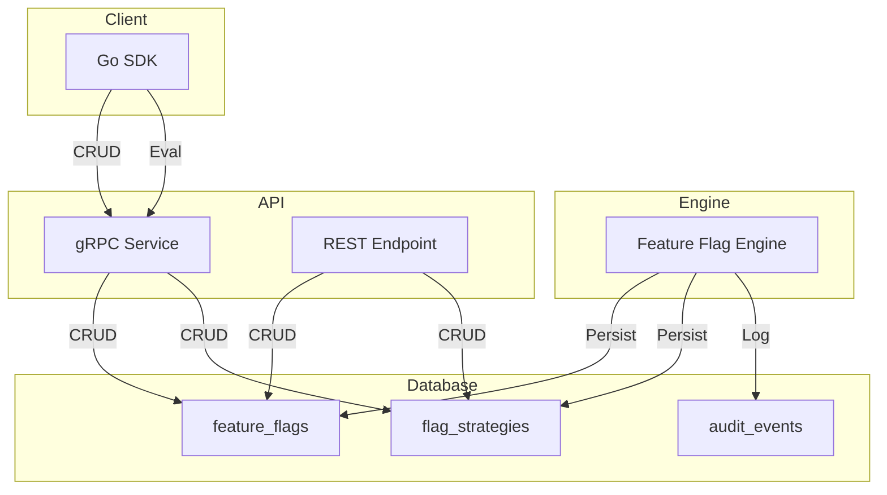

# Feature‑Flag Mermaid Diagram

```mermaid
flowchart TD
    subgraph Engine
        FE[Feature Flag Engine]
    end
    subgraph API
        GRPC[gRPC Service]
        REST[REST Endpoint]
    end
    subgraph DB[Database]
        Flags[feature_flags]
        Strategies[flag_strategies]
        Audit[audit_events]
    end
    subgraph Client
        GoSDK[Go SDK]
    end

    FE -->|Persist| Flags
    FE -->|Persist| Strategies
    FE -->|Log| Audit
    GRPC -->|CRUD| Flags
    GRPC -->|CRUD| Strategies
    REST -->|CRUD| Flags
    REST -->|CRUD| Strategies
    GoSDK -->|CRUD| GRPC
    GoSDK -->|Eval| GRPC
```
